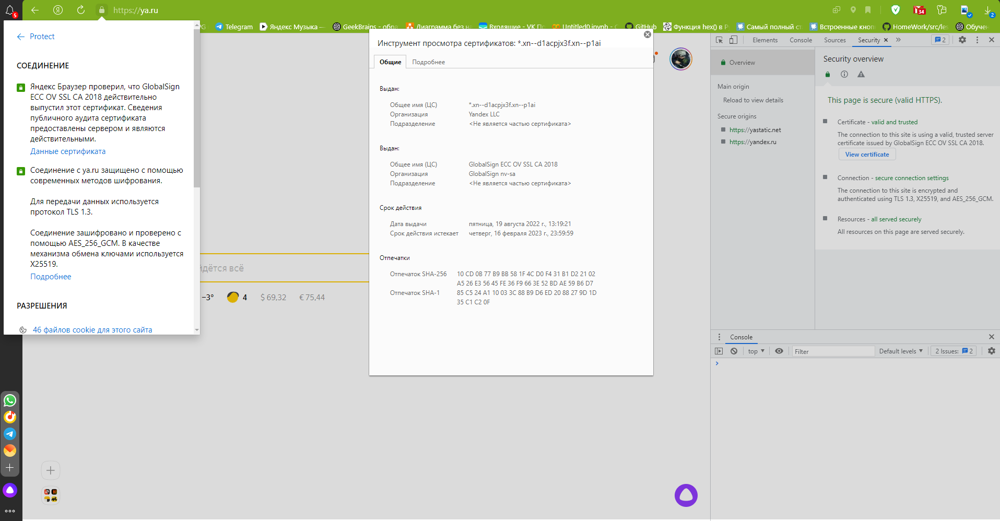
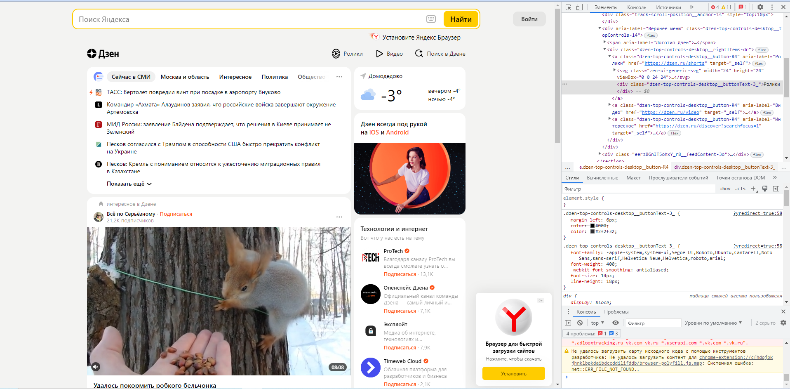
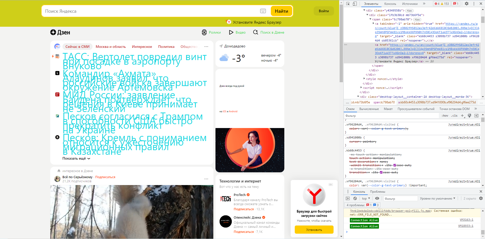

Урок 1. Веб-технологии: вчера, сегодня, завтра
Задача: на основе сайта yandex.ru:

1.Определите, на каком протоколе работает сайт.  
  2.Проанализируйте структуру страницы сайта.  
  3.Внесите не менее 10 изменений на страницу с помощью инструмента разработчика и представьте скриншоты было/стало.  
  4.Создайте прототип низкой детализации (дополнительное задание, если на семинаре дошли до задания №8).  

  1. Для передачи данных используется Protocol	TLS 1.3 
   Тип соединения HTTPS// - защищенный.

  2. https://www.figma.com/file/jwZgdFbRXItgc0Zzy4JMGh/Untitled?node-id=1%3A4&t=ZrT3YopZzXANf7y4-1

  3. ДО

  
   После

